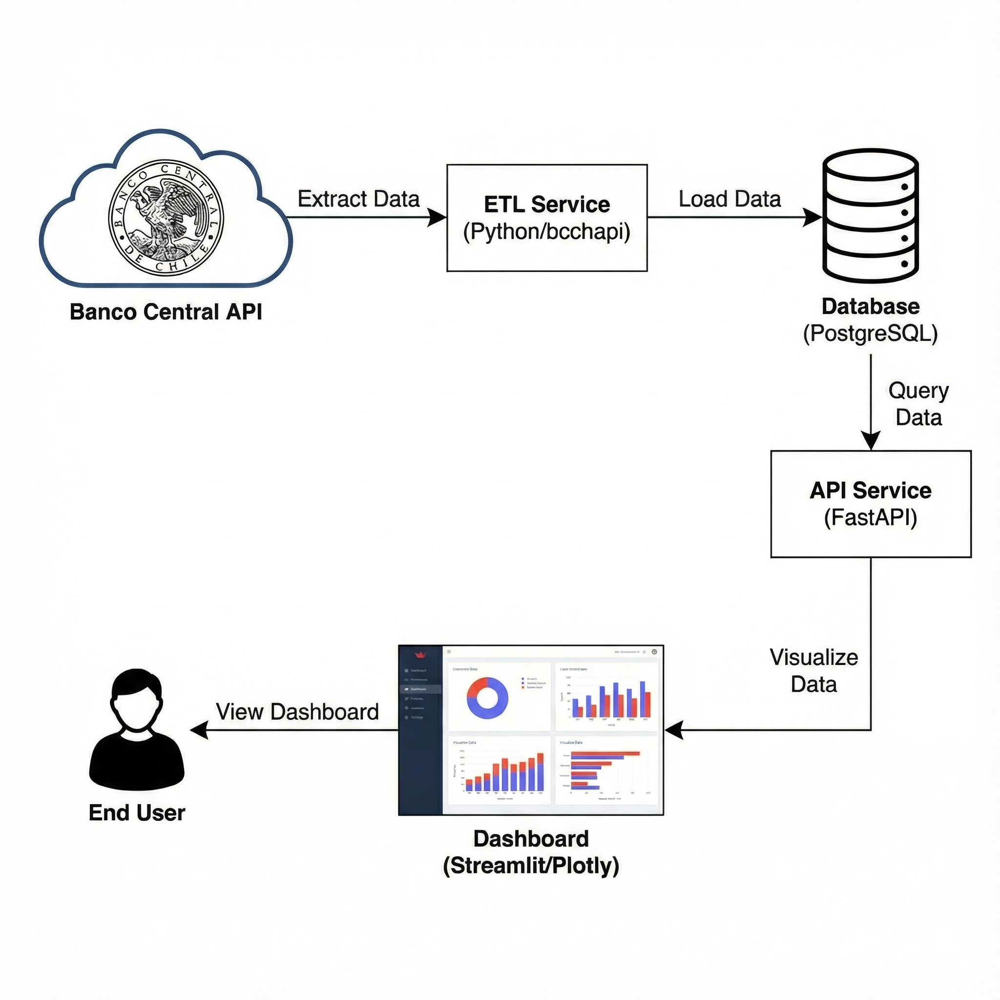

# 🏠 Chile Housing Ops - MVP


> **Estado:** 🟢 Operativo (MVP) | **Rama:** `maqueta-inicial`

Este proyecto implementa una arquitectura de **Data Engineering End-to-End** contenerizada y preparada para la nube (Cloud Native Ready). Su objetivo es la ingesta, persistencia y visualización de indicadores económicos chilenos (UF) utilizando prácticas modernas de DevOps.

El sistema se conecta a la **API del Banco Central de Chile**, procesa la data histórica y la expone mediante microservicios desacoplados. Incluye configuración de CI/CD para despliegue automático en **Google Cloud Platform**.

## 🏗️ Arquitectura del Sistema

El flujo de datos sigue un patrón lineal de extracción, carga y consumo, orquestado completamente con Docker Compose.



### Componentes:

1.  **🐘 PostgreSQL (Persistencia):** Base de datos relacional con volúmenes persistentes y script de inicialización (`init.sql`).
2.  **⚙️ ETL (Ingesta):** Servicio en Python que utiliza la librería `bcchapi` para extraer series históricas y realizar operaciones de *Upsert* en la base de datos.
3.  **⚡ API (Backend):** Servicio RESTful (FastAPI) que actúa como capa de abstracción de datos, sirviendo respuestas JSON validadas.
4.  **📊 Dashboard (Frontend):** Interfaz en **Streamlit** con gráficos interactivos (Plotly) para el usuario final.

## 🛠️ Stack Tecnológico

* **Infraestructura:** Docker, Docker Compose y Google Cloud Build.
* **Automatización:** Makefile.
* **Backend & Datos:** Python 3.11, FastAPI, Pydantic, Pandas, Bcchapi.
* **Base de Datos:** PostgreSQL 16 (Alpine).
* **Frontend:** Streamlit.

## 🚀 Instalación y Despliegue

### 1. Pre-requisitos
* Docker Engine & Docker Compose (V2)
* Git
* (Opcional) Make (para usar los atajos de comandos)

### 2. Clonar el repositorio
```bash
git clone [https://github.com/diadasiachilensis/chile-housing-ops.git](https://github.com/diadasiachilensis/chile-housing-ops.git)
cd chile-housing-ops
```

### 3. Configuración de Entorno (Seguridad)

El proyecto incluye una plantilla de variables. Crea tu archivo `.env` basado en el ejemplo:

```bash
cp .env.example .env
```

> ⚠️ **Importante:** Abre el archivo `.env` y edita las variables `BCCH_USER` y `BCCH_PASS` con tus credenciales reales del Banco Central.

### 4. Ejecución (Modo Profesional)

Hemos incluido un `Makefile` para simplificar la operación.

**Levantar todo el sistema:**

```bash
make up
```

*(Equivalente a `docker compose up -d`)*

**Reconstruir tras cambios de código:**

```bash
make build
```

*(Equivalente a `docker compose up -d --build`)*

**Ver logs en tiempo real:**

```bash
make logs
```

> **Nota:** Al iniciar, el servicio ETL descargará automáticamente la historia de la UF. Busca en los logs el mensaje: `✅ Carga finalizada`.

## 🖥️ Acceso a los Servicios

| Servicio | URL Local | Descripción |
| --- | --- | --- |
| **📊 Dashboard** | `http://localhost:8501` | Visualización interactiva y KPI de la UF. |
| **⚡ API Docs** | `http://localhost:8000/docs` | Swagger UI para probar endpoints. |
| **⚡ API Redoc** | `http://localhost:8000/redoc` | Documentación técnica alternativa. |

## 📂 Estructura del Proyecto

```text
chile-housing-ops/
├── api/                # Microservicio Backend (FastAPI)
├── dashboard/          # Microservicio Frontend (Streamlit)
├── etl/                # Pipeline de Datos (Python)
├── postgres/           # Scripts SQL de inicialización
├── cloudbuild.yaml     # CI/CD para Google Cloud Platform
├── docker-compose.yml  # Orquestación Local
├── Makefile            # Automatización de comandos
├── .env.example        # Plantilla de configuración
└── requirements.txt    # Dependencias base

```

## 🔮 Roadmap

Este proyecto sigue una ruta de evolución hacia una arquitectura Cloud Native:

* [x] **Dockerización:** Contenerización completa de servicios.
* [x] **GCP Prep:** Configuración de `cloudbuild.yaml` y Artifact Registry.
* [ ] **CI/CD:** Implementación de Triggers en Google Cloud Build.
* [ ] **Cloud Run:** Despliegue Serverless de la API y Dashboard.
* [ ] **Cloud SQL:** Migración de la base de datos a servicio gestionado.

---

Hecho con 💻 y ☕ en Chile.
