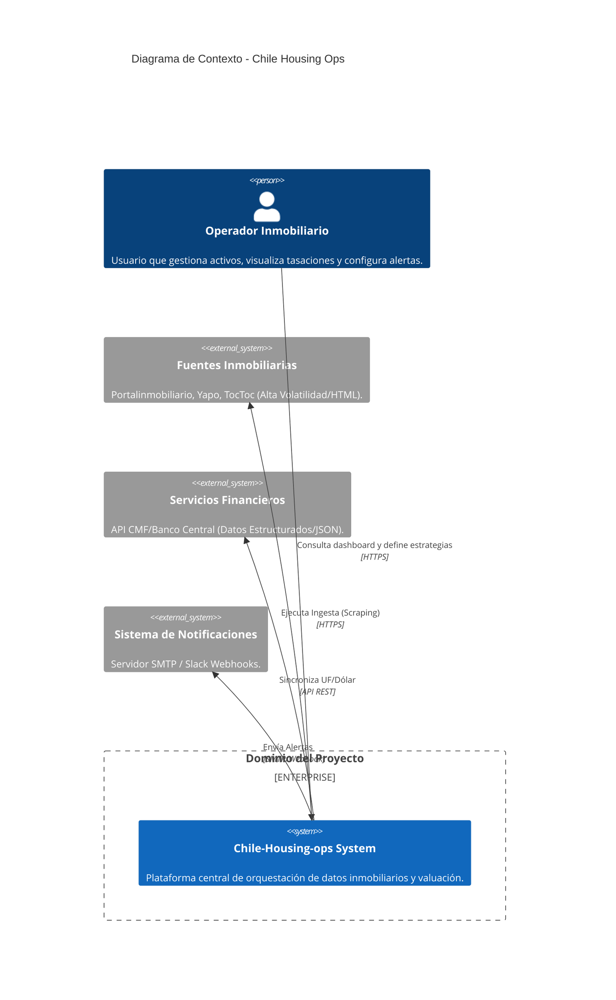
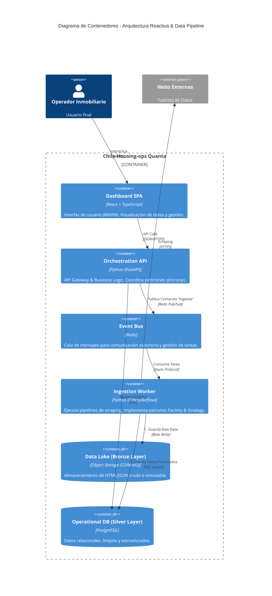

# Arquitectura del Sistema: Chile-Housing-ops

**Autor:** *Diadasia chilensis*

**Fecha:** Diciembre 2025

**Versión:** 1.0.0 (Fase de Diseño)

Este documento define la estructura de alto nivel del sistema siguiendo el modelo C4 y justifica las decisiones técnicas basándose en principios de Ingeniería de Software Moderna e Ingeniería de Datos.

---

## 1. Nivel 1: Diagrama de Contexto del Sistema

**Objetivo:** Visualizar cómo interactúa el sistema con el mundo exterior (Usuarios y Sistemas de Terceros).

---

## 2. Nivel 2: Diagrama de Contenedores

**Objetivo:** Mostrar las unidades desplegables, la elección tecnológica y los patrones de comunicación.

**Decisión Crítica:** Se implementa una Arquitectura Basada en Eventos para desacoplar la interfaz de usuario (Baja Latencia) del proceso de ingesta de datos (Alta Latencia/Batch).

---

## 3. Justificación Teórica y Alineación Bibliográfica

La arquitectura de 'Chile-Housing-ops' no es arbitraria; responde a *trade-offs* de ingeniería específicos analizados en la literatura especializada. A continuación, se detalla la matriz de correspondencia entre los conceptos teóricos y la implementación en los diagramas.

| Libro | Concepto Clave Aplicado | Aplicación en el Diagrama |
| --- | --- | --- |
| **Software Architecture: The Hard Parts** (Ford & Richards) | **Architectural Quanta & Static/Dynamic Coupling.** Identificamos que el "Scraping" y la "UI" tienen características operativas opuestas (alta vs. baja volatilidad), forzando una separación física. | En la decisión de separar el contenedor `API` del `Ingestion Worker` usando una cola asíncrona, creando dos *quanta* desplegables independientemente. |
| **Fundamentals of Software Architecture** (Richards & Ford) | **Event-Driven Architecture (EDA).** Priorizamos la elasticidad y la capacidad de reacción ante cambios de estado sobre una arquitectura monolítica en capas tradicional. | En la implementación del `Msg Broker (Redis)` como mediador para la comunicación asíncrona entre servicios. |
| **Head First Design Patterns** (Freeman et al.) | **Encapsulate What Varies.** Principio base para aislar la lógica de parsing que cambia con cada web (yapo, portalinmobiliario). | En la definición interna del `Ingestion Worker`, utilizando explícitamente **Strategy** (para algoritmos de limpieza) y **Factory** (para instanciar parsers). |
| **Data Engineering Design Patterns** (Späti / General) | **Decoupling Compute from Storage & Medallion Architecture.** La idea de que el procesamiento no debe estar atado a la base de datos final y debe existir trazabilidad. | En la creación del `Raw Store (Bronze Layer)` para preservar la data cruda (HTML) antes de su transformación a la `Operational DB (Silver Layer)`. |
| **Architecting Data and ML Platforms** (Desai et al.) | **Data Lineage & Replayability.** La capacidad de "reproducir" la historia de los datos si el código de parsing cambia o se corrige un bug. | En la arquitectura de flujo dual: los datos siempre se persisten primero en crudo, permitiendo reprocesamientos (backfill) futuros sin volver a scrapear la fuente. |

---

## 4. Bibliografía (APA 7.ª Edición)

* Desai, T., & Shah, M. (2023). *Architecting data and machine learning platforms: Enable analytics and AI-driven innovation*. O'Reilly Media.
* Ford, N., & Richards, M. (2021). *Software architecture: The hard parts: Modern trade-off analysis for distributed architectures*. O'Reilly Media.
* Freeman, E., Robson, E., Bates, B., & Sierra, K. (2004). *Head first design patterns*. O'Reilly Media.
* Reis, J., & Housley, M. (2022). *Fundamentals of data engineering: Plan and build robust data systems*. O'Reilly Media. [Referencia académica para patrones de ingeniería de datos].
* Richards, M., & Ford, N. (2020). *Fundamentals of software architecture: An engineering approach*. O'Reilly Media.
* Späti, S. (2023). *Data engineering design patterns*. O'Reilly Media / Self-published GitBook.
